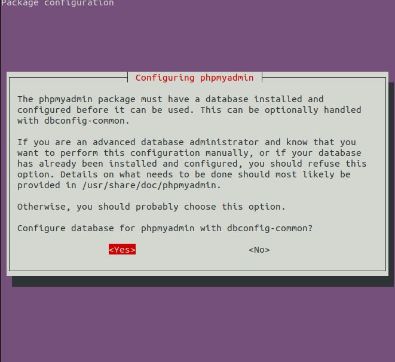

# Install phpmyadmin and mysql manually in ubuntu


we are going to install phpmyadmin and mysql manually. We don't need xammp and you can use globally in you PC.


## Installation

First we are going to install apache web server

```bash
  sudo apt-get update
```
    
```bash
  sudo apt-get upgrade
```
```bash
  sudo apt-get install tasksel
```
```bash
  sudo tasksel install lamp-server
```
```bash
  sudo apt-get update
```
```bash
  sudo systemctl restart apache2
```

And check php version

```bash
  php -v
```

Go to browser and enter "localhost"


And check mysql version
```bash
  mysql -V
```

And we are going to install mysql account

```bash
  sudo mysql
```


```bash
create user 'admin'@'localhost' identified by '123456';
```

```bash
grant all privileges on * . * to 'admin'@'localhost';
```

```bash
flush privileges;
```

```bash
exit;
```

And install phpmyadmin


```bash
sudo apt install phpmyadmin
```


Choose 'apache2' by using arrow and space


And use tap to go to ok and Enter


And choose yes and Enter



Enter Password "123456"


And comfirm password

Go to Browser and enter "localhost/phpmyadmin"

Enter user-admin and password-123456


Create a folder and Create a file "index.php"

In "index.php" write "<?php echo 'hello'; ?>"

Save this file and open terminal and run

```bash
php -S localhost:8000
```


Go to browser and enter "localhost:8000"
